DATA 598: Final Project Report
================
Hriday Baghar
June 8, 2022

# Introduction

Recent news coverage of the World Air Quality Report by IQAir (a Swiss
organization) showed that 35 Indian cities were in the top 50 of the
world’s most polluted cities (The Indian Express, 2022). It has been
established and extensively documented that exposure to high amounts of
air pollution leads to serious respiratory problems. Records show that
in 2019 over 1.6 million deaths were attributed to poor air quality. The
cause of death ranged from strokes, diabetes, lung cancer and myocardial
infarctions (IQAir, 2022).

Poor air quality has become a cause for concern in recent years where
the city of Delhi, India had to enforce stay at home guidelines
(Hindustan Times, 2021) and shut down schools (DW, 2021). It is clear
that there is a need to develop solutions and take measures to bring air
pollution under control, so that people can live their lives without
disruption and without the risk of illness.

Models for the series can help identify:

-   seasonal patterns of different frequency in pollution and air
    quality and serve as a starting point for policymakers to
    investigate sources of air pollution and how they can be controlled
-   trends of air quality to check how interventions have impacted air
    quality in the short and long term

``` r
library(fpp3)
library(astsa)  # for mvspec()
```

``` r
data <- read.csv("data/city_day_raw.csv") |>
   select(c(City,Date,AQI)) |>
   mutate(Date = as.Date(Date, format="%Y-%m-%d")) |>
   filter(City %in% c("Bengaluru", "Chennai", "Delhi", "Hyderabad", "Lucknow"))
```

# Exploratory Data Analysis

## a. Plot the series

``` r
ggplot(data = data, aes(x=Date, y=AQI, color=City)) +
         geom_line()+
         facet_grid(City ~.)
```

    ## Warning: Removed 326 row(s) containing missing values (geom_path).

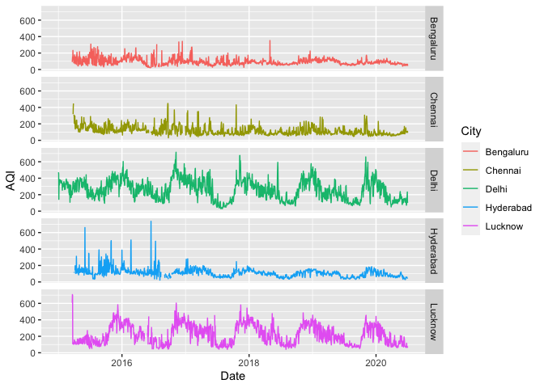<!-- -->

## b. Series description

Observations:

-   Some series have missing values in the start (we will remove them)
-   Some series also have missing values in between - we will impute
    them with the previous value (downward filling)
-   For the first two years, Hyderabad data has very big outliers
    compared to the rest of the years (possible that something about the
    sensors changed)
-   Seasonality
    -   Clear annual seasonal pattern in Delhi and Lucknow - cities in
        northern India
    -   Not so clear in Chennai, Bengaluru and Hyderabad - cities in
        southern India
    -   Might be worth looking into some domain knowledge regarding air
        quality

### Handling missing values

``` r
data |>
  group_by(City) |>
  summarise(missing.percent = sum(is.na(AQI))/n()*100)
```

    ## # A tibble: 5 × 2
    ##   City      missing.percent
    ##   <chr>               <dbl>
    ## 1 Bengaluru           4.93 
    ## 2 Chennai             6.22 
    ## 3 Delhi               0.498
    ## 4 Hyderabad           6.28 
    ## 5 Lucknow             5.77

Most of the missing values are likely due to the long runs of NAs in the
beginning for each city. We can fill the NAs in between with the
previous value and filter out the starting runs of NAs.

First, let us fill “downwards” i.e. only for dates which have data on
the previous day. This will fill the previous day’s value in the missing
field.

``` r
data |>
  group_by(City) |>
  fill(AQI, .direction = "down") |>
  summarise(missing.percent = sum(is.na(AQI))/n()*100)
```

    ## # A tibble: 5 × 2
    ##   City      missing.percent
    ##   <chr>               <dbl>
    ## 1 Bengaluru            3.93
    ## 2 Chennai              4.08
    ## 3 Delhi                0   
    ## 4 Hyderabad            4.29
    ## 5 Lucknow              3.93

We now see that most of the missing data is only from the long runs of
NA in the start. We can safely filter those records out.

We clean the missing values in the following manner:

-   Group data by City
-   Fill missing values downwards
-   Remove remaining missing values at the start

``` r
(data <- data |>
  group_by(City) |>
  fill(AQI, .direction = "down") |>
  filter(!is.na(AQI)))
```

    ## # A tibble: 9,716 × 3
    ## # Groups:   City [5]
    ##    City      Date         AQI
    ##    <chr>     <date>     <dbl>
    ##  1 Bengaluru 2015-03-21    91
    ##  2 Bengaluru 2015-03-22   120
    ##  3 Bengaluru 2015-03-23   154
    ##  4 Bengaluru 2015-03-24   119
    ##  5 Bengaluru 2015-03-25   232
    ##  6 Bengaluru 2015-03-26   132
    ##  7 Bengaluru 2015-03-27   123
    ##  8 Bengaluru 2015-03-28   152
    ##  9 Bengaluru 2015-03-29   143
    ## 10 Bengaluru 2015-03-30    80
    ## # … with 9,706 more rows

``` r
ggplot(data = data, aes(x=Date, y=AQI, color=City)) +
         geom_line()+
         facet_grid(City ~.)
```

<!-- -->

## c. Evaluating Stationarity

``` r
data <- data |>
  as_tsibble(index = Date, key = City)

data |>
  features(AQI, unitroot_ndiffs)
```

    ## # A tibble: 5 × 2
    ##   City      ndiffs
    ##   <chr>      <int>
    ## 1 Bengaluru      1
    ## 2 Chennai        1
    ## 3 Delhi          1
    ## 4 Hyderabad      1
    ## 5 Lucknow        1

We use the `ndiffs` function to evaluate stationarity. It is clear that
each series is non-stationary and would require one differencing
operation. We will require to perform this again when we decide to
modify the level of our data.

## d. Investigating Seasonality

We use spectral analysis to identify if there are multiple seasonal
patterns. Based on our observations we will decide how to roll up the
data.

``` r
delhi.spec <- mvspec(data[data$City == "Delhi", "AQI"], detrend = TRUE, spans = 5)
```

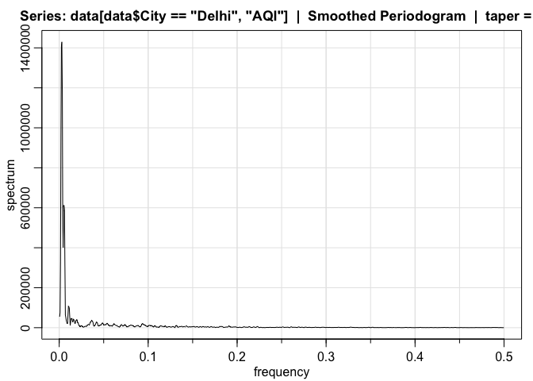<!-- -->

``` r
lucknow.spec <- mvspec(data[data$City == "Lucknow", "AQI"], detrend = TRUE, spans = 5)
```

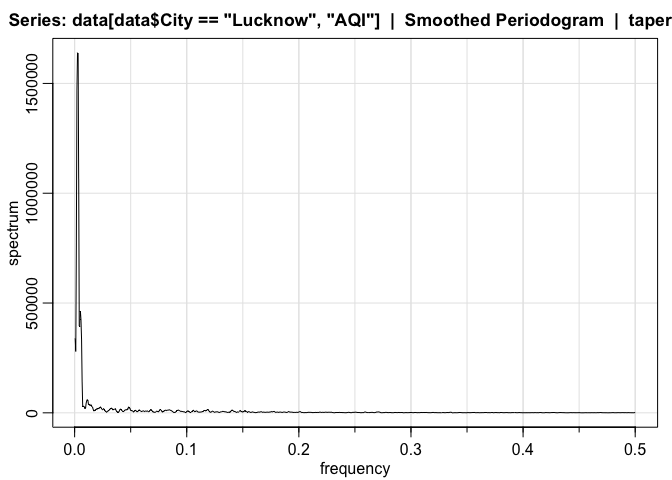<!-- -->

``` r
chennai.spec <- mvspec(data[data$City == "Chennai", "AQI"], detrend = TRUE, spans = 5)
```

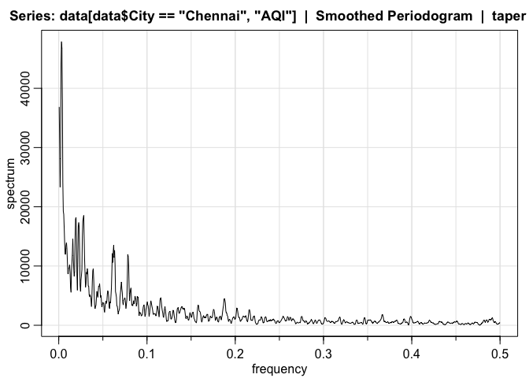<!-- -->

``` r
bengaluru.spec <- mvspec(data[data$City == "Bengaluru", "AQI"], detrend = TRUE, spans = 5)
```

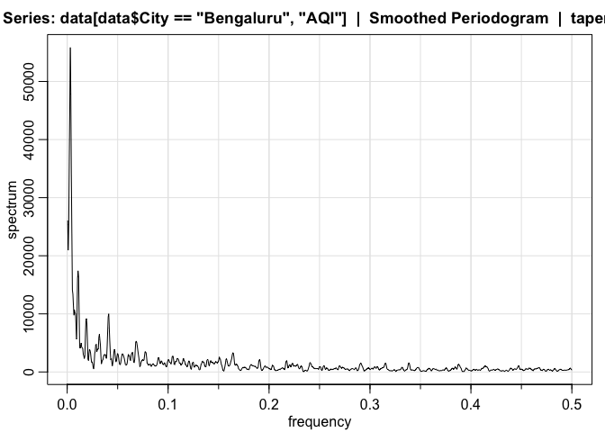<!-- -->

``` r
hyderabad.spec <- mvspec(data[data$City == "Hyderabad", "AQI"], detrend = TRUE, spans = 5)
```

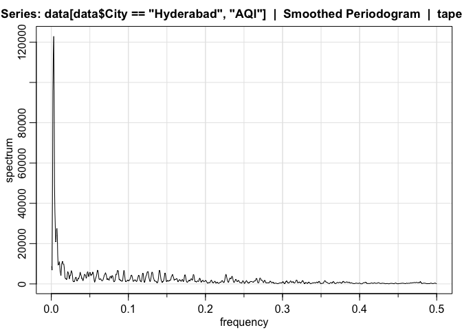<!-- -->

Initial plots suggest that Delhi and Lucknow have a single seasonal
pattern, probably the strong annual pattern that we saw in the plots.
Hyderabad is also suggestive of a single seasonal pattern. We could see
a weak pattern in the plots so this should not be surprising.

Bengaluru and Chennai have slightly more complicated plots

Let us observe all peaks. Peak thresholds have been listed for each
series as comments based on the spectral plots above

``` r
get.spec.df <- function(spec){
  return(data.frame(spec$details))
}

delhi.spec <- get.spec.df(delhi.spec)
bengaluru.spec <- get.spec.df(bengaluru.spec)
chennai.spec <- get.spec.df(chennai.spec)
lucknow.spec <- get.spec.df(lucknow.spec)
hyderabad.spec <- get.spec.df(hyderabad.spec)

# Anything > 400,000 for Delhi
delhi.spec |> filter(spectrum > 400000) |> arrange(desc(spectrum))
```

    ##   frequency   period  spectrum
    ## 1    0.0030 337.5000 1429770.1
    ## 2    0.0025 405.0000 1405032.7
    ## 3    0.0035 289.2857 1192047.7
    ## 4    0.0020 506.2500  974836.9
    ## 5    0.0054 184.0909  611925.1
    ## 6    0.0049 202.5000  609912.1
    ## 7    0.0059 168.7500  586935.5
    ## 8    0.0040 253.1250  567373.7
    ## 9    0.0044 225.0000  401246.1

``` r
# Anything > 250,000 for Lucknow
lucknow.spec |> filter(spectrum > 40000) |> arrange(desc(spectrum))
```

    ##    frequency    period   spectrum
    ## 1     0.0026  388.8000 1639476.58
    ## 2     0.0031  324.0000 1635788.29
    ## 3     0.0021  486.0000 1465784.65
    ## 4     0.0036  277.7143 1065902.83
    ## 5     0.0015  648.0000  777092.90
    ## 6     0.0051  194.4000  463143.71
    ## 7     0.0057  176.7273  424077.73
    ## 8     0.0041  243.0000  397417.85
    ## 9     0.0046  216.0000  391343.55
    ## 10    0.0005 1944.0000  339813.12
    ## 11    0.0062  162.0000  335642.74
    ## 12    0.0010  972.0000  279736.97
    ## 13    0.0067  149.5385  141288.25
    ## 14    0.0113   88.3636   60118.21
    ## 15    0.0118   84.5217   56434.30
    ## 16    0.0108   92.5714   54759.99
    ## 17    0.0103   97.2000   43767.60

``` r
# Anything > 15,000 for Chennai
chennai.spec |> filter(spectrum > 15000) |> arrange(desc(spectrum))
```

    ##    frequency    period spectrum
    ## 1     0.0031  324.0000 47886.86
    ## 2     0.0036  277.7143 46776.24
    ## 3     0.0026  388.8000 44059.75
    ## 4     0.0041  243.0000 38142.38
    ## 5     0.0005 1944.0000 36850.41
    ## 6     0.0010  972.0000 30704.17
    ## 7     0.0021  486.0000 28071.32
    ## 8     0.0046  216.0000 24100.55
    ## 9     0.0015  648.0000 23335.65
    ## 10    0.0051  194.4000 19271.26
    ## 11    0.0057  176.7273 18727.97
    ## 12    0.0283   35.3455 18541.12
    ## 13    0.0195   51.1579 18209.25
    ## 14    0.0278   36.0000 18052.08
    ## 15    0.0190   52.5405 17930.79
    ## 16    0.0273   36.6792 17575.54
    ## 17    0.0226   44.1818 17340.32
    ## 18    0.0221   45.2093 16655.65
    ## 19    0.0231   43.2000 16547.35
    ## 20    0.0062  162.0000 16478.47
    ## 21    0.0201   49.8462 15037.00
    ## 22    0.0267   37.3846 15026.31

``` r
# Anything > 20,000 for Bengaluru
bengaluru.spec |> filter(spectrum > 20000) |> arrange(desc(spectrum))
```

    ##   frequency    period spectrum
    ## 1    0.0031  324.0000 55841.12
    ## 2    0.0036  277.7143 47777.66
    ## 3    0.0026  388.8000 45733.27
    ## 4    0.0021  486.0000 36283.75
    ## 5    0.0041  243.0000 34004.44
    ## 6    0.0005 1944.0000 26091.02
    ## 7    0.0015  648.0000 25401.20
    ## 8    0.0046  216.0000 23792.16
    ## 9    0.0010  972.0000 20947.71

``` r
# Anything > 25,000 for Hyderabad
hyderabad.spec |> filter(spectrum > 25000) |> arrange(desc(spectrum))
```

    ##    frequency   period  spectrum
    ## 1     0.0031 320.0000 122896.69
    ## 2     0.0026 384.0000 113574.83
    ## 3     0.0036 274.2857  96186.72
    ## 4     0.0021 480.0000  96000.89
    ## 5     0.0042 240.0000  49442.58
    ## 6     0.0016 640.0000  43115.11
    ## 7     0.0047 213.3333  35542.95
    ## 8     0.0052 192.0000  27722.66
    ## 9     0.0073 137.1429  27491.60
    ## 10    0.0068 147.6923  26661.93

Observations:

-   Delhi, Lucknow and Hyderabad appear to have a seasonal pattern that
    occurs roughly annually (all 3 have peaks around 340 - 400 days)
-   Bengaluru and Chennai exhibit relatively much weaker seasonal
    behavior but this seasonal pattern also appears to occur annually.

Given the above observations, we can model the seasonality as annual.
For ARIMA modeling, we should roll up our data to a monthly level and
model the seasonal period as 12.

``` r
data <- data |>
  as_tibble() |>
  mutate(Date = yearmonth(Date)) |>
  group_by(City, Date) |>
  summarise(AQI = mean(AQI)) |>
  as_tsibble(index = Date, key = City)
```

    ## `summarise()` has grouped output by 'City'. You can override using the
    ## `.groups` argument.

``` r
write.csv(x = data |> as_tibble(), file = "data/city_month_cleaned.csv")
```

Plotting rolled up data:

``` r
data |> autoplot(AQI) + facet_grid(City ~ .)
```

    ## `mutate_if()` ignored the following grouping variables:
    ## • Column `City`

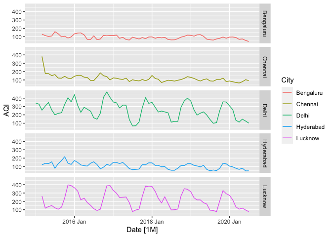<!-- -->

Re-analyzing seasonal pattern on rolled up data

``` r
delhi.spec <- mvspec(data[data$City == "Delhi", "AQI"], detrend = TRUE, spans = 2)
```

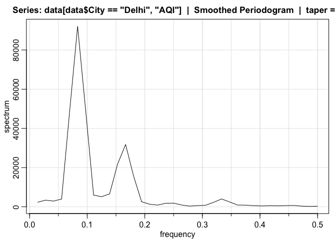<!-- -->

``` r
lucknow.spec <- mvspec(data[data$City == "Lucknow", "AQI"], detrend = TRUE, spans = 2)
```

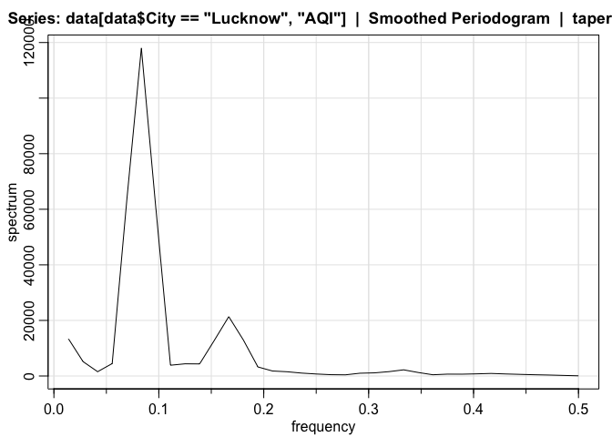<!-- -->

``` r
chennai.spec <- mvspec(data[data$City == "Chennai", "AQI"], detrend = TRUE, spans = 2)
```

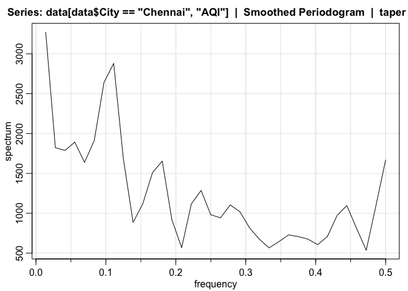<!-- -->

``` r
bengaluru.spec <- mvspec(data[data$City == "Bengaluru", "AQI"], detrend = TRUE, spans = 2)
```

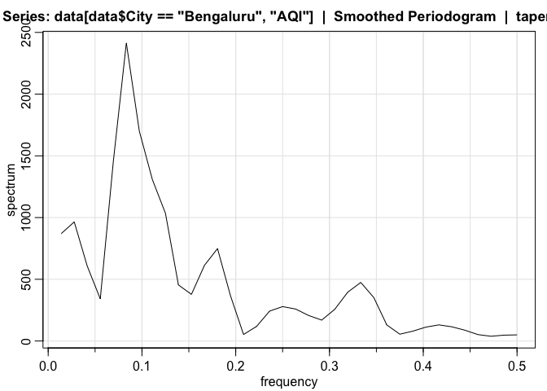<!-- -->

``` r
hyderabad.spec <- mvspec(data[data$City == "Hyderabad", "AQI"], detrend = TRUE, spans = 2)
```

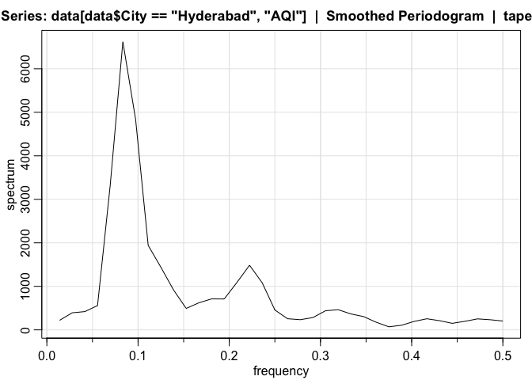<!-- -->

``` r
delhi.spec <- get.spec.df(delhi.spec)
bengaluru.spec <- get.spec.df(bengaluru.spec)
chennai.spec <- get.spec.df(chennai.spec)
lucknow.spec <- get.spec.df(lucknow.spec)
hyderabad.spec <- get.spec.df(hyderabad.spec)

head(delhi.spec |> arrange(desc(spectrum)))
```

    ##   frequency  period spectrum
    ## 1    0.0833 12.0000 92039.05
    ## 2    0.0972 10.2857 49442.67
    ## 3    0.0694 14.4000 48518.62
    ## 4    0.1667  6.0000 31787.03
    ## 5    0.1528  6.5455 21819.76
    ## 6    0.1806  5.5385 15642.56

``` r
head(lucknow.spec |> arrange(desc(spectrum)))
```

    ##   frequency  period  spectrum
    ## 1    0.0833 12.0000 118009.11
    ## 2    0.0694 14.4000  63179.60
    ## 3    0.0972 10.2857  60057.08
    ## 4    0.1667  6.0000  21361.00
    ## 5    0.0139 72.0000  13362.27
    ## 6    0.1806  5.5385  12966.35

``` r
head(chennai.spec |> arrange(desc(spectrum)))
```

    ##   frequency  period spectrum
    ## 1    0.0139 72.0000 3273.838
    ## 2    0.1111  9.0000 2879.934
    ## 3    0.0972 10.2857 2640.238
    ## 4    0.0833 12.0000 1911.123
    ## 5    0.0556 18.0000 1892.193
    ## 6    0.0278 36.0000 1822.395

``` r
head(bengaluru.spec |> arrange(desc(spectrum)))
```

    ##   frequency  period  spectrum
    ## 1    0.0833 12.0000 2414.1561
    ## 2    0.0972 10.2857 1698.7839
    ## 3    0.0694 14.4000 1453.2423
    ## 4    0.1111  9.0000 1307.5155
    ## 5    0.1250  8.0000 1035.6042
    ## 6    0.0278 36.0000  964.7626

``` r
head(hyderabad.spec |> arrange(desc(spectrum)))
```

    ##   frequency  period spectrum
    ## 1    0.0833 12.0000 6619.792
    ## 2    0.0972 10.2857 4845.133
    ## 3    0.0694 14.4000 3318.923
    ## 4    0.1111  9.0000 1940.089
    ## 5    0.2222  4.5000 1484.920
    ## 6    0.1250  8.0000 1439.564

Our hypothesis seems to be correct. We see a clear 12 month seasonal
pattern in all cities except Chennai. We also see a smaller pattern in
all series other than Chennai, but those peaks are much smaller than the
12 month peaks. For now we choose not to include them in our seasonal
pattern.

The 72 month pattern for Chennai does not make sense as the data itself
covers 5 years. Chennai does seem to exhibit seasonal patterns of 9,
10.28, 12 and 18 months. Contrary to other cities, the seasonal pattern
does not have one clear influence. It is worth noting that Chennai is
the only coastal city out of all the cities in the data. Perhaps this
influences the seasonality of AQI? More investigation and comparison of
other coastal cities (specifically on India’s east coast) would be
required to make a clear conclusion.

## e. ACF and PACF

``` r
# Re-evaluating stationarity

data |> features(AQI, unitroot_kpss)
```

    ## # A tibble: 5 × 3
    ##   City      kpss_stat kpss_pvalue
    ##   <chr>         <dbl>       <dbl>
    ## 1 Bengaluru     0.630      0.0199
    ## 2 Chennai       1.04       0.01  
    ## 3 Delhi         0.387      0.0828
    ## 4 Hyderabad     0.866      0.01  
    ## 5 Lucknow       0.115      0.1

``` r
data |> features(AQI, unitroot_ndiffs)
```

    ## # A tibble: 5 × 2
    ##   City      ndiffs
    ##   <chr>      <int>
    ## 1 Bengaluru      1
    ## 2 Chennai        1
    ## 3 Delhi          0
    ## 4 Hyderabad      1
    ## 5 Lucknow        0

``` r
data |> features(AQI, unitroot_nsdiffs)
```

    ## # A tibble: 5 × 2
    ##   City      nsdiffs
    ##   <chr>       <int>
    ## 1 Bengaluru       0
    ## 2 Chennai         0
    ## 3 Delhi           1
    ## 4 Hyderabad       0
    ## 5 Lucknow         1

We see that Delhi and Lucknow require a seasonal difference and the
others require a non-seasonal difference.

``` r
data |> 
  filter(City %in% c("Delhi", "Lucknow"))  |>
  features(difference(AQI, lag = 12), unitroot_ndiffs)
```

    ## # A tibble: 2 × 2
    ##   City    ndiffs
    ##   <chr>    <int>
    ## 1 Delhi        0
    ## 2 Lucknow      1

Lucknow also requires a non-seasonal difference after a seasonal
difference.

``` r
data |> filter(City == "Delhi") |> gg_tsdisplay(difference(AQI, lag = 12),
                                                plot_type = "partial")
```

    ## Warning: Removed 12 row(s) containing missing values (geom_path).

    ## Warning: Removed 12 rows containing missing values (geom_point).

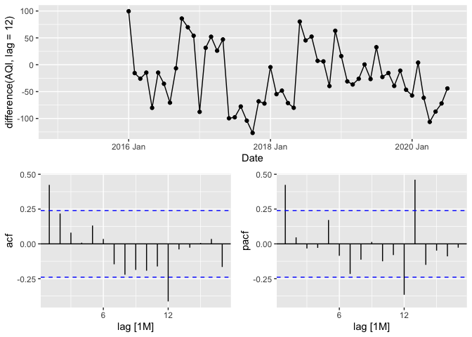<!-- -->

``` r
data |> filter(City == "Lucknow") |> gg_tsdisplay(difference(
                                                        difference(AQI, lag=12),
                                                        lag = 1),
                                                  plot_type = "partial")
```

    ## Warning: Removed 13 row(s) containing missing values (geom_path).

    ## Warning: Removed 13 rows containing missing values (geom_point).

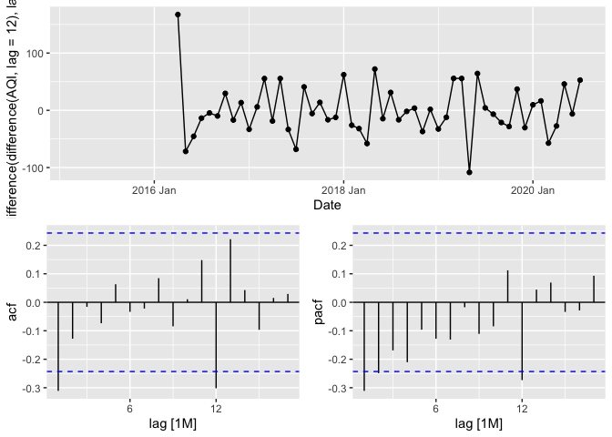<!-- -->

``` r
data |> filter(City == "Chennai") |> gg_tsdisplay(difference(AQI),
                                                  plot_type = "partial")
```

    ## Warning: Removed 1 row(s) containing missing values (geom_path).

    ## Warning: Removed 1 rows containing missing values (geom_point).

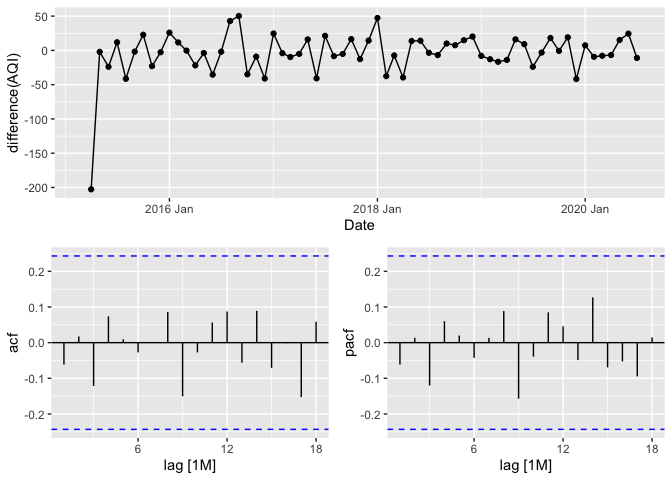<!-- -->

``` r
data |> filter(City == "Bengaluru") |> gg_tsdisplay(difference(AQI),
                                                    plot_type = "partial")
```

    ## Warning: Removed 1 row(s) containing missing values (geom_path).
    ## Removed 1 rows containing missing values (geom_point).

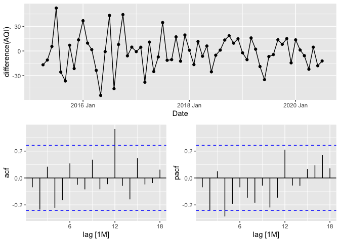<!-- -->

``` r
data |> filter(City == "Hyderabad") |> gg_tsdisplay(difference(AQI),
                                                    plot_type = "partial")
```

    ## Warning: Removed 1 row(s) containing missing values (geom_path).
    ## Removed 1 rows containing missing values (geom_point).

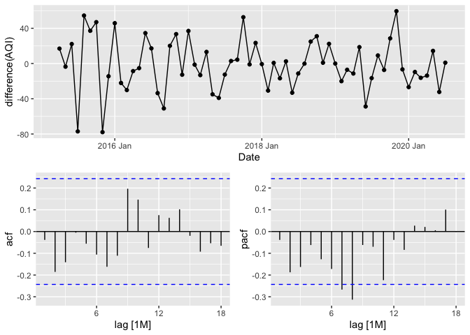<!-- -->

Candidate models:

-   Delhi: pdq(1,0,1)+PDQ(1,1,1)\[12\]
    -   Clear AR and MA spike at 1, seasonal AR and MA spike at 12
-   Lucknow: pdq(1,1,1)+PDQ(1,1,1)\[12\]
    -   Clear AR and MA spike at 1, seasonal AR and MA spike at 12
-   Chennai: pdq(0,1,0)+PDQ(0,0,0)\[12\]
    -   No significant spikes whatsoever
-   Bengaluru: pdq(0,1,0)+PDQ(0,0,1)\[12\]
    -   Seasonal MA spike at 12 in ACF
-   Hyderabad: pdq(0,1,0)+PDQ(0,0,0)\[12\]
    -   No significant spikes whatsoever
    -   We will iterate with a seasonal term since we saw a weak
        seasonal pattern

# ARIMA Modeling

Splitting data into train and test

``` r
train <- data |> filter(Date < yearmonth("2019 Jun"))
test <- data |> filter(Date >= yearmonth("2019 Jun"))
```

We now build the candidate models and and display their fit metrics and
residuals. It is clear from the plots below that all the series are
white noise.

## Delhi: pdq(1,0,1)+PDQ(1,1,1)\[12\]

``` r
delhi.fit <- train |>
  filter(City == "Delhi") |>
  model(arima = ARIMA(AQI ~ pdq(1,0,1) + PDQ(1,1,1)))

glance(delhi.fit)
```

    ## # A tibble: 1 × 9
    ##   City  .model sigma2 log_lik   AIC  AICc   BIC ar_roots   ma_roots  
    ##   <chr> <chr>   <dbl>   <dbl> <dbl> <dbl> <dbl> <list>     <list>    
    ## 1 Delhi arima   1048.   -210.  431.  434.  441. <cpl [13]> <cpl [13]>

``` r
report(delhi.fit)
```

    ## Series: AQI 
    ## Model: ARIMA(1,0,1)(1,1,1)[12] w/ drift 
    ## 
    ## Coefficients:
    ##          ar1     ma1     sar1     sma1  constant
    ##       0.4098  0.1929  -0.4944  -0.8443  -18.1421
    ## s.e.  0.2453  0.2689   0.2375   1.5218    4.8199
    ## 
    ## sigma^2 estimated as 1048:  log likelihood=-209.59
    ## AIC=431.18   AICc=433.65   BIC=441.46

``` r
delhi.fit |> gg_tsresiduals(lag = 12)
```

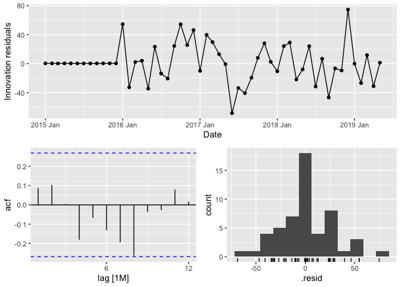<!-- -->

## Lucknow: pdq(1,1,1)+PDQ(1,1,1)\[12\]

``` r
lucknow.fit <- train |>
  filter(City == "Lucknow") |>
  model(arima = ARIMA(AQI ~ pdq(1,1,1) + PDQ(1,1,1)))

glance(lucknow.fit)
```

    ## # A tibble: 1 × 9
    ##   City    .model sigma2 log_lik   AIC  AICc   BIC ar_roots   ma_roots  
    ##   <chr>   <chr>   <dbl>   <dbl> <dbl> <dbl> <dbl> <list>     <list>    
    ## 1 Lucknow arima   1384.   -192.  394.  396.  402. <cpl [13]> <cpl [13]>

``` r
report(lucknow.fit)
```

    ## Series: AQI 
    ## Model: ARIMA(1,1,1)(1,1,1)[12] 
    ## 
    ## Coefficients:
    ##          ar1      ma1    sar1     sma1
    ##       0.2035  -0.8997  0.1987  -0.6631
    ## s.e.  0.2043   0.1192  0.4572   0.5464
    ## 
    ## sigma^2 estimated as 1384:  log likelihood=-191.89
    ## AIC=393.78   AICc=395.65   BIC=401.97

``` r
lucknow.fit |> gg_tsresiduals(lag = 12)
```

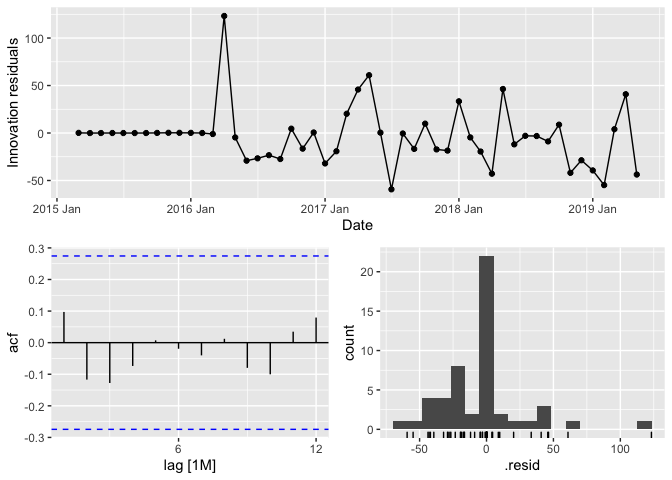<!-- -->

## Chennai: pdq(0,1,0)+PDQ(0,0,0)\[12\]

``` r
chennai.fit <- train |>
  filter(City == "Chennai") |>
  model(arima = ARIMA(AQI ~ pdq(0,1,0) + PDQ(0,0,0)))

glance(chennai.fit)
```

    ## # A tibble: 1 × 9
    ##   City    .model sigma2 log_lik   AIC  AICc   BIC ar_roots  ma_roots 
    ##   <chr>   <chr>   <dbl>   <dbl> <dbl> <dbl> <dbl> <list>    <list>   
    ## 1 Chennai arima   1316.   -251.  503.  503.  505. <cpl [0]> <cpl [0]>

``` r
report(chennai.fit)
```

    ## Series: AQI 
    ## Model: ARIMA(0,1,0) 
    ## 
    ## sigma^2 estimated as 1316:  log likelihood=-250.5
    ## AIC=503.01   AICc=503.09   BIC=504.92

``` r
chennai.fit |> gg_tsresiduals(lag=12)
```

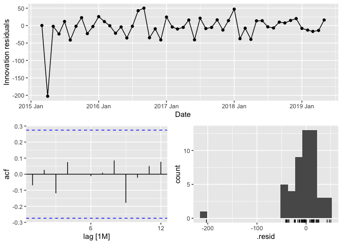<!-- -->

## Bengaluru: pdq(0,1,0)+PDQ(0,0,1)\[12\]

``` r
bengaluru.fit <- train |>
  filter(City == "Bengaluru") |>
  model(arima = ARIMA(AQI ~ pdq(0,1,0) + PDQ(0,0,1)))

glance(bengaluru.fit)
```

    ## # A tibble: 1 × 9
    ##   City      .model sigma2 log_lik   AIC  AICc   BIC ar_roots  ma_roots  
    ##   <chr>     <chr>   <dbl>   <dbl> <dbl> <dbl> <dbl> <list>    <list>    
    ## 1 Bengaluru arima    419.   -222.  448.  449.  452. <cpl [0]> <cpl [12]>

``` r
report(bengaluru.fit)
```

    ## Series: AQI 
    ## Model: ARIMA(0,1,0)(0,0,1)[12] 
    ## 
    ## Coefficients:
    ##         sma1
    ##       0.3586
    ## s.e.  0.1441
    ## 
    ## sigma^2 estimated as 419.1:  log likelihood=-222.22
    ## AIC=448.44   AICc=448.69   BIC=452.26

``` r
bengaluru.fit |> gg_tsresiduals(lag = 12)
```

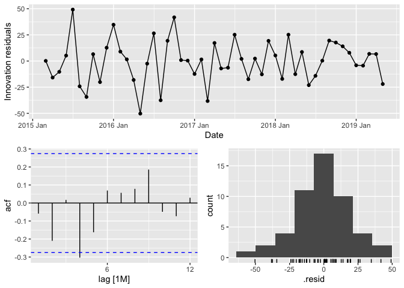<!-- -->

## Hyderabad: pdq(0,1,0)+PDQ(0,0,0)\[12\]

``` r
hyderabad.fit <- train |>
  filter(City == "Hyderabad") |>
  model(arima = ARIMA(AQI ~ pdq(0,1,0) + PDQ(0,0,0)))

glance(hyderabad.fit)
```

    ## # A tibble: 1 × 9
    ##   City      .model sigma2 log_lik   AIC  AICc   BIC ar_roots  ma_roots 
    ##   <chr>     <chr>   <dbl>   <dbl> <dbl> <dbl> <dbl> <list>    <list>   
    ## 1 Hyderabad arima    870.   -240.  482.  482.  484. <cpl [0]> <cpl [0]>

``` r
report(hyderabad.fit)
```

    ## Series: AQI 
    ## Model: ARIMA(0,1,0) 
    ## 
    ## sigma^2 estimated as 869.7:  log likelihood=-240.15
    ## AIC=482.3   AICc=482.38   BIC=484.21

``` r
hyderabad.fit |> gg_tsresiduals(lag=12)
```

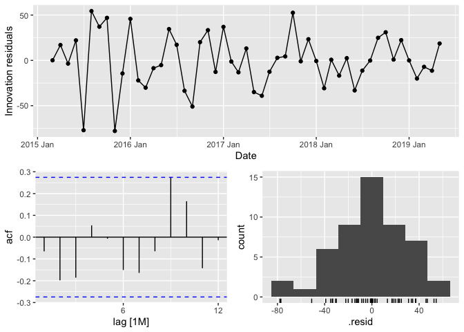<!-- -->

Let us add a seasonal term in Hyderabad model since we saw that the
series did exhibit weak seasonality. We compare models with 1 AR term
only, 1 MA term only and 1 AR and MA term. Since we are including a
seasonal term we use a seasonal difference on this model.

``` r
#MA term only
report(train |>
  filter(City == "Hyderabad") |>
  model(arima = ARIMA(AQI ~ pdq(0,0,0) + PDQ(0,1,1))))
```

    ## Series: AQI 
    ## Model: ARIMA(0,0,0)(0,1,1)[12] w/ drift 
    ## 
    ## Coefficients:
    ##          sma1  constant
    ##       -0.7178  -13.6292
    ## s.e.   0.4353    3.2881
    ## 
    ## sigma^2 estimated as 927.8:  log likelihood=-191.51
    ## AIC=389.02   AICc=389.71   BIC=394.01

``` r
#AR term only
report(train |>
  filter(City == "Hyderabad") |>
  model(arima = ARIMA(AQI ~ pdq(0,0,0) + PDQ(1,1,0))))
```

    ## Series: AQI 
    ## Model: ARIMA(0,0,0)(1,1,0)[12] w/ drift 
    ## 
    ## Coefficients:
    ##          sar1  constant
    ##       -0.4717  -21.3408
    ## s.e.   0.1539    5.7460
    ## 
    ## sigma^2 estimated as 1089:  log likelihood=-192.19
    ## AIC=390.39   AICc=391.07   BIC=395.38

``` r
#AR and MA term
report(train |>
  filter(City == "Hyderabad") |>
  model(arima = ARIMA(AQI ~ pdq(0,0,0) + PDQ(1,1,1))))
```

    ## Series: AQI 
    ## Model: ARIMA(0,0,0)(1,1,1)[12] w/ drift 
    ## 
    ## Coefficients:
    ##         sar1     sma1  constant
    ##       0.0623  -0.8626  -12.6512
    ## s.e.  0.5699   2.1957    3.3017
    ## 
    ## sigma^2 estimated as 876.6:  log likelihood=-191.51
    ## AIC=391.01   AICc=392.19   BIC=397.67

We see that the seasonal terms considerably improved the AICc of the
model. The model with only the seasonal MA term appears to be the best
option given its lowest AICc value and being a simpler model. However,
the seasonal MA term may not be significant given it is smaller than 2

S.E. The seasonal AR model does not seem to suffer from this

Let us check the residuals

``` r
gg_tsresiduals(train |>
  filter(City == "Hyderabad") |>
  model(arima = ARIMA(AQI ~ pdq(0,0,0) + PDQ(1,1,0))), lag=12)
```

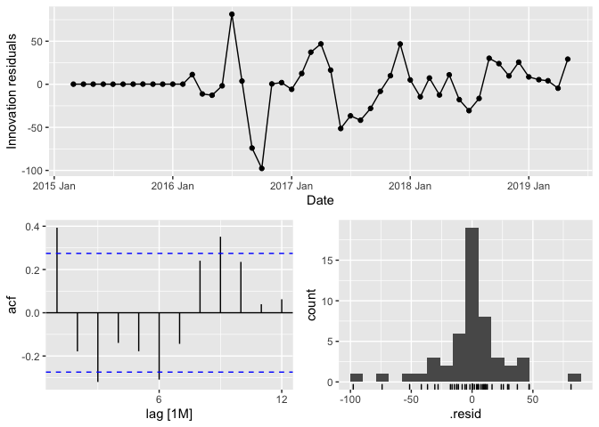<!-- -->

We see that there are some significant spikes in the residual ACF, spike
1 is more prominent. Perhaps we can apply a non-seasonal difference as
well.

``` r
hyderabad.fit.seas <- train |>
  filter(City == "Hyderabad") |>
  model(arima = ARIMA(AQI ~ pdq(0,1,0) + PDQ(1,1,0)))

report(hyderabad.fit.seas)
```

    ## Series: AQI 
    ## Model: ARIMA(0,1,0)(1,1,0)[12] 
    ## 
    ## Coefficients:
    ##          sar1
    ##       -0.4781
    ## s.e.   0.1619
    ## 
    ## sigma^2 estimated as 1280:  log likelihood=-190.91
    ## AIC=385.82   AICc=386.17   BIC=389.1

``` r
gg_tsresiduals(hyderabad.fit.seas, lag=12)
```

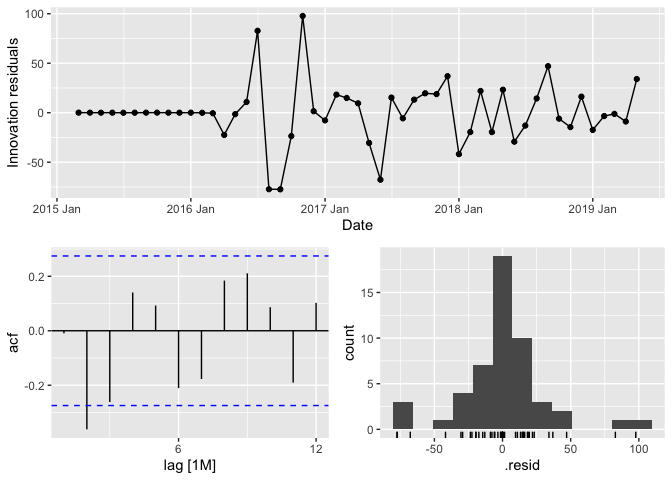<!-- -->

This model still sees a spike at lag 2. We could compare the forecasts
of the seasonal and non-seasonal models for this city to see which one
does better.

## Using Automatic model Selection

``` r
fit <- train |> model(ARIMA(AQI, stepwise = FALSE))
fit |>
  pivot_longer(cols = -City, names_to = "Model name", values_to = "Model") |>
  mutate(model.details = format(Model))
```

    ## # A mable: 5 x 4
    ## # Key:     City, Model name [5]
    ##   City      `Model name`                                     Model model.details
    ##   <chr>     <chr>                                          <model> <chr>        
    ## 1 Bengaluru ARIMA(AQI, stepwis…  <ARIMA(1,0,0)(1,0,0)[12] w/ mean> <ARIMA(1,0,0…
    ## 2 Chennai   ARIMA(AQI, stepwis…                     <ARIMA(0,1,0)> <ARIMA(0,1,0…
    ## 3 Delhi     ARIMA(AQI, stepwis… <ARIMA(0,0,1)(1,1,1)[12] w/ drift> <ARIMA(0,0,1…
    ## 4 Hyderabad ARIMA(AQI, stepwis…                     <ARIMA(1,1,1)> <ARIMA(1,1,1…
    ## 5 Lucknow   ARIMA(AQI, stepwis…          <ARIMA(0,0,1)(0,1,1)[12]> <ARIMA(0,0,1…

``` r
glance(fit)
```

    ## # A tibble: 5 × 9
    ##   City      .model            sigma2 log_lik   AIC  AICc   BIC ar_roots ma_roots
    ##   <chr>     <chr>              <dbl>   <dbl> <dbl> <dbl> <dbl> <list>   <list>  
    ## 1 Bengaluru ARIMA(AQI, stepw…   335.   -220.  449.  450.  456. <cpl>    <cpl>   
    ## 2 Chennai   ARIMA(AQI, stepw…  1316.   -251.  503.  503.  505. <cpl>    <cpl>   
    ## 3 Delhi     ARIMA(AQI, stepw…  1229.   -211.  431.  433.  440. <cpl>    <cpl>   
    ## 4 Hyderabad ARIMA(AQI, stepw…   745.   -236.  478.  478.  483. <cpl>    <cpl>   
    ## 5 Lucknow   ARIMA(AQI, stepw…  1177.   -195.  396.  396.  401. <cpl>    <cpl>

Note that automatic selection did not pick a seasonal model for
Hyderabad.

# Additonal Analysis

We compare forecasts for Hyderabad using a seasonal and non-seasonal
model

## Hyderabad Non-seasonal vs Seasonal Model Forecast

``` r
hyderabad.fit |> forecast(new_data = test) |>
  autoplot(train)+
  geom_line(data = test |> filter(City == "Hyderabad"), aes(x=Date, y=AQI), 
            color = "red", linetype = "longdash", alpha=0.7)
```

    ## `mutate_if()` ignored the following grouping variables:
    ## • Column `City`

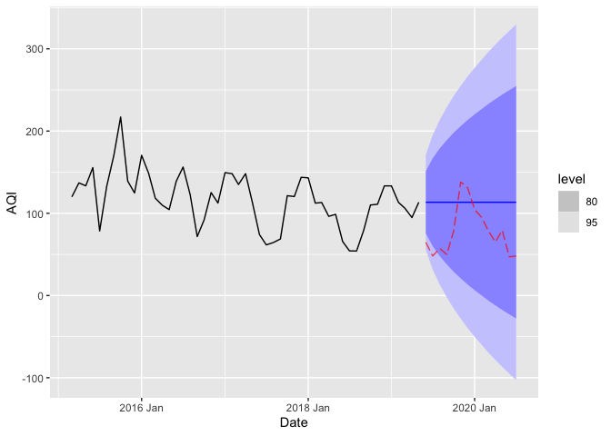<!-- -->

``` r
hyderabad.fit |> forecast(new_data = test) |> accuracy(test)
```

    ## # A tibble: 1 × 11
    ##   .model City      .type    ME  RMSE   MAE   MPE  MAPE  MASE RMSSE  ACF1
    ##   <chr>  <chr>     <chr> <dbl> <dbl> <dbl> <dbl> <dbl> <dbl> <dbl> <dbl>
    ## 1 arima  Hyderabad Test  -35.9  46.1  42.0 -65.4  69.9   NaN   NaN 0.644

``` r
hyderabad.fit.seas |> forecast(new_data = test) |>
  autoplot(train)+
  geom_line(data = test |> filter(City == "Hyderabad"), aes(x=Date, y=AQI), 
            color = "red", linetype = "longdash", alpha=0.7)
```

    ## `mutate_if()` ignored the following grouping variables:
    ## • Column `City`

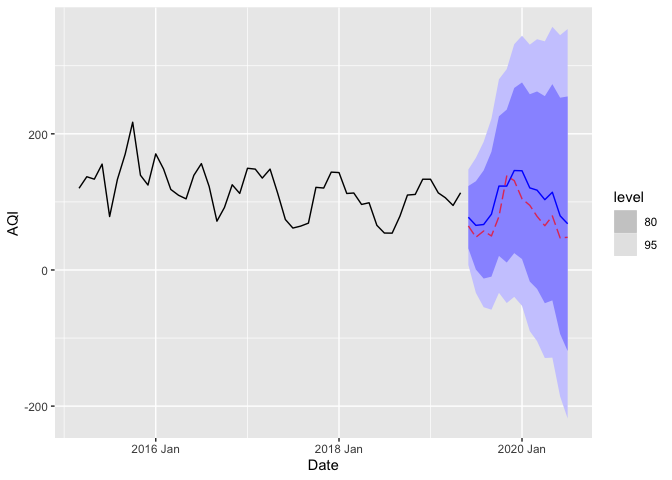<!-- -->

``` r
hyderabad.fit.seas |> forecast(new_data = test) |> accuracy(test)
```

    ## # A tibble: 1 × 11
    ##   .model City      .type    ME  RMSE   MAE   MPE  MAPE  MASE RMSSE   ACF1
    ##   <chr>  <chr>     <chr> <dbl> <dbl> <dbl> <dbl> <dbl> <dbl> <dbl>  <dbl>
    ## 1 arima  Hyderabad Test  -24.8  29.2  26.9 -37.3  38.9   NaN   NaN 0.0185

We see that the seasonal model does a much better job of forecasting the
AQI than the non-seasonal model. We must note that the the forecasts are
off by a lot potentially because the test data is from the year 2020. We
could try techniques other than ARIMA and compare their performance.

## Forecasting the Remaining Series

We now conduct forecasts for the remaining cities and check model
performance.

### Delhi

``` r
delhi.fit |> forecast(new_data = test) |>
   autoplot(train)+
   geom_line(data = test |> filter(City == "Delhi"), aes(x=Date, y=AQI), 
            color = "red", linetype = "longdash", alpha=0.7)
```

    ## `mutate_if()` ignored the following grouping variables:
    ## • Column `City`

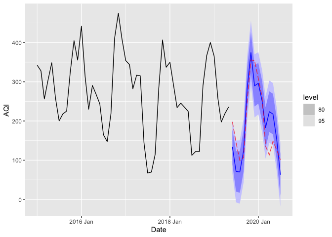<!-- -->

``` r
delhi.fit |> forecast(new_data = test) |> accuracy(test)
```

    ## # A tibble: 1 × 11
    ##   .model City  .type    ME  RMSE   MAE   MPE  MAPE  MASE RMSSE  ACF1
    ##   <chr>  <chr> <chr> <dbl> <dbl> <dbl> <dbl> <dbl> <dbl> <dbl> <dbl>
    ## 1 arima  Delhi Test  -2.09  52.0  43.9 -4.15  29.4   NaN   NaN 0.534

### Lucknow

``` r
lucknow.fit |> forecast(new_data = test) |>
   autoplot(train)+
   geom_line(data = test |> filter(City == "Lucknow"), aes(x=Date, y=AQI), 
            color = "red", linetype = "longdash", alpha=0.7)
```

    ## `mutate_if()` ignored the following grouping variables:
    ## • Column `City`

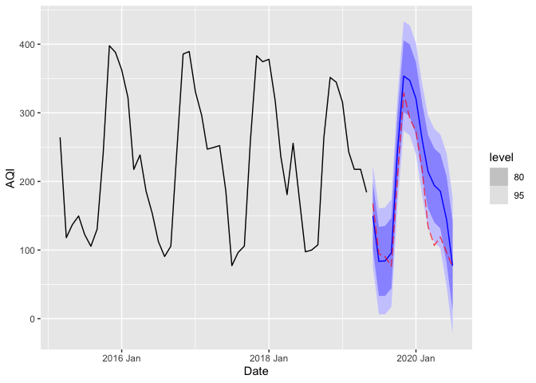<!-- -->

``` r
lucknow.fit |> forecast(new_data = test) |> accuracy(test)
```

    ## # A tibble: 1 × 11
    ##   .model City    .type    ME  RMSE   MAE   MPE  MAPE  MASE RMSSE  ACF1
    ##   <chr>  <chr>   <chr> <dbl> <dbl> <dbl> <dbl> <dbl> <dbl> <dbl> <dbl>
    ## 1 arima  Lucknow Test  -34.0  47.0  39.0 -23.4  27.5   NaN   NaN 0.646

### Bengaluru

``` r
bengaluru.fit |> forecast(new_data = test) |>
   autoplot(train)+
   geom_line(data = test |> filter(City == "Bengaluru"), aes(x=Date, y=AQI), 
            color = "red", linetype = "longdash", alpha=0.7)
```

    ## `mutate_if()` ignored the following grouping variables:
    ## • Column `City`

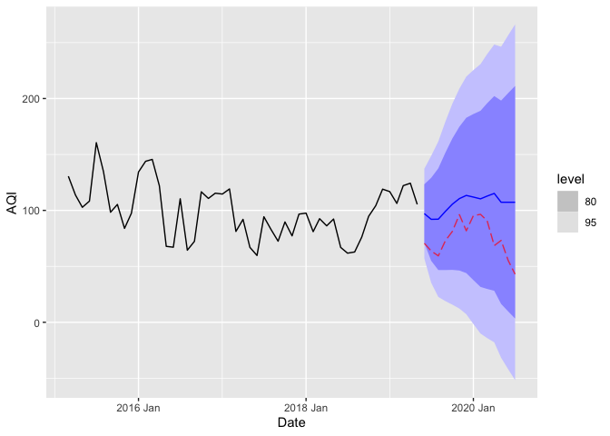<!-- -->

``` r
bengaluru.fit |> forecast(new_data = test) |> accuracy(test)
```

    ## # A tibble: 1 × 11
    ##   .model City      .type    ME  RMSE   MAE   MPE  MAPE  MASE RMSSE  ACF1
    ##   <chr>  <chr>     <chr> <dbl> <dbl> <dbl> <dbl> <dbl> <dbl> <dbl> <dbl>
    ## 1 arima  Bengaluru Test  -31.0  34.0  31.0 -48.0  48.0   NaN   NaN 0.434

### Chennai

``` r
chennai.fit |> forecast(new_data = test) |>
   autoplot(train)+
   geom_line(data = test |> filter(City == "Chennai"), aes(x=Date, y=AQI), 
            color = "red", linetype = "longdash", alpha=0.7)
```

    ## `mutate_if()` ignored the following grouping variables:
    ## • Column `City`

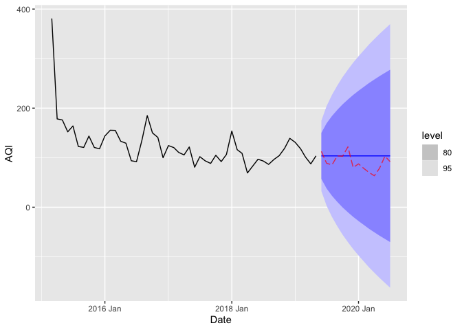<!-- -->

``` r
chennai.fit |> forecast(new_data = test) |> accuracy(test)
```

    ## # A tibble: 1 × 11
    ##   .model City    .type    ME  RMSE   MAE   MPE  MAPE  MASE RMSSE  ACF1
    ##   <chr>  <chr>   <chr> <dbl> <dbl> <dbl> <dbl> <dbl> <dbl> <dbl> <dbl>
    ## 1 arima  Chennai Test  -13.0  20.5  16.9 -17.9  21.2   NaN   NaN 0.335

# Summary and Implications

We see that the series for Chennai was not suitably modeled by ARIMA.
With no AR and MA terms it will be a flat line segment. We would expect
the ARIMA models to work well with cities with well defined seasonal
behavior such as Lucknow and Delhi, and even relatively less defined
seasonal behavior for cities like Bengaluru and Hyderabad.

The forecasts show us that this is indeed true. Lucknow and Delhi have
the best model performance as measured by accuracy metrics and the
seasonal model is able to adequately able to capture the seasonality of
the AQI (although the accuracy is not extremely high.

We see that the Bengaluru model performs poorly even though the seasonal
pattern is captured by the model. We discuss the accuracy later in this
section. Chennai’s model has the highest accuracy but that is because
the variation in AQI is not very high to begin with.

This analysis has shown us the importance of modeling seasonality. If we
were to choose the automatic search model for Hyderabad or just use the
ACF and PACF to decide which model to pick, we would have been left
worse off with a model that would not be very reliable or helpful. The
seasonality analysis helped us make a better model choice.

Lastly, given that the test data is from the year 2020, we should expect
most models to perform poorly on this data. We see that this is true for
all the series that we have forecasted. We can see that all the
forecasts for the year 2020 are much higher than the true values in the
test data.

India had some of the most stringent lock down measures in place and the
level of pollution dropped drastically in the early months of 2020 since
economic activity mostly came to a standstill. Given that underlying
data generating processes were dramatically altered, we must expect the
performance of any forecasting model to be sub-optimal.

For next steps, we must test other forecasting techniques on this data.
We could use machine learning based models, ETS or other techniques and
check if they are able to improve accuracy. Another attempt to forecast
could incorporate weather data - air quality is highly dependent on
weather data. We could add other predictors with weather data to check
if this helps improve model performance.

Given the forecasting accuracy and that the data is for the year 2020,
these models would be useful if we had more years of data so that we
could make longer forecasts and test long term accuracy of these models.
